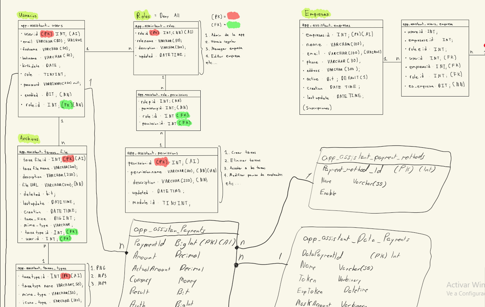
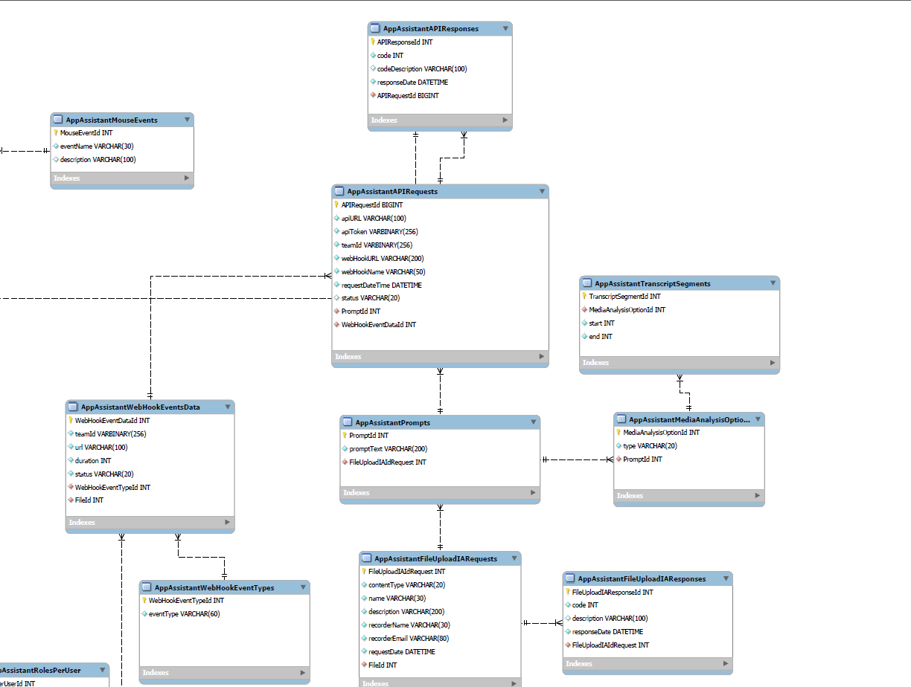
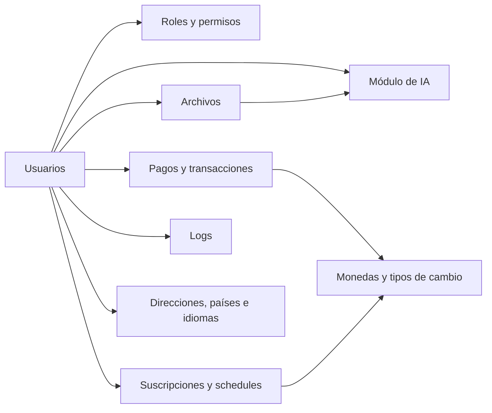
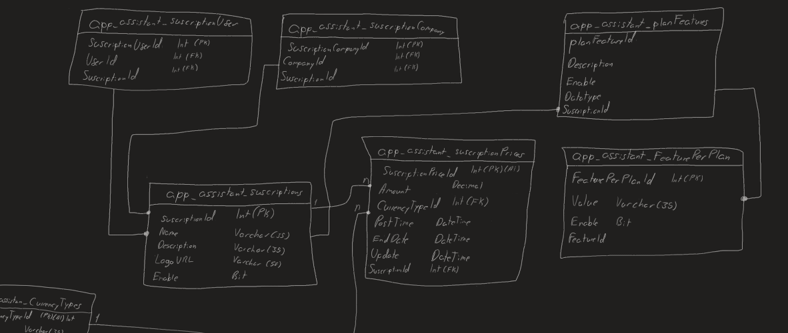
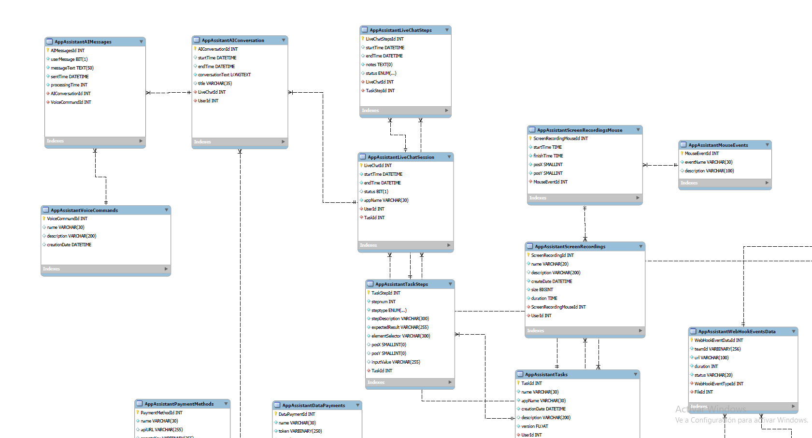

<h1 align="center">App Assistant – Bases de Datos I</h1>

Diseño e implementación en MySQL de la base de datos de una *App Assistant AI*, basicamente una aplicación con asistente de inteligencia artificial que maneja usuarios, roles, pagos, suscripciones, archivos, logs y todo lo necesario para ejecutar tareas con IA. Incluye el modelo de datos, el script de creación de las tablas, el llenado de datos de prueba y consultas de análisis. Hecho para el curso Bases de Datos I (Caso #1).

<p align="center">
  
  
</p>

<p align="center">
  
  
  
  
</p>

---

## Tabla de Contenidos
- [Features](#features)
- [Autores](#autores)
- [Diseño de la Base de Datos](#diseño-de-la-base-de-datos)
- [Tecnologías](#tecnologías)
- [Estructura del Proyecto](#estructura-del-proyecto)
- [Ejecucion](#ejecucion)
- [Consultas](#consultas)
- [Aprendizaje](#aprendizaje)

---

## Features
* **55 tablas** en el esquema `caso1db`, con llaves primarias y foráneas, agrupadas en módulos (usuarios, pagos, suscripciones, logs, IA, etc.).
* **Seguridad por diseño:** contraseñas guardadas como `VARBINARY`, pagos con *token* y cuenta enmascarada para no almacenar datos bancarios, y un *checksum* en pagos, transacciones y logs.
* **Roles y permisos** flexibles: un usuario puede tener varios roles y cada rol varios permisos.
* **Pagos multimoneda:** tipos de moneda y tipos de cambio por fecha.
* **Suscripciones** con 3 planes, sus beneficios, precios por moneda y calendarización de los cobros.
* **Registro de actividad (logs)** clasificado por tipo, origen y severidad.
* **Módulo de IA:** solicitudes y respuestas a APIs, *webhooks*, prompts, tareas por pasos, sesiones de chat en vivo, conversaciones, comandos de voz y grabaciones de pantalla.
* **Datos de prueba generados con procedimientos almacenados** (50 usuarios, 150 suscripciones, logs, archivos y eventos de webhook).
* **Consultas de análisis** sobre pagos, vencimientos de suscripciones y uso de la aplicación.

---

## Autores
* Christopher Daniel Vargas Villalta, 2024108443
* Andrés Baldi Mora

**Curso:** Bases de Datos I

---

## Diseño de la Base de Datos
* **Motor:** MySQL 8 (InnoDB, `utf8mb4`), modelado con MySQL Workbench.
* **Convención:** todas las tablas llevan el prefijo `AppAssistant`.



| Módulo | Tablas principales |
|--------|--------------------|
| Usuarios, roles y permisos | `Users`, `Roles`, `RolesPerUser`, `Permissions`, `RolePermissions` |
| Archivos | `Files`, `FileTypes` |
| Pagos y transacciones | `Payments`, `PaymentMethods`, `DataPayments`, `ResultPayment`, `Transactions`, `TransactionsTypes`, `TransactionsSubTypes` |
| Monedas | `CurrencyTypes`, `CurrencyExchanges` |
| Ubicación e idiomas | `Countries`, `States`, `Cities`, `Address`, `UserAddresses`, `Languages`, `LanguagesPerCountry`, `Translations` |
| Suscripciones | `Suscriptions`, `SuscriptionPrices`, `SuscriptionUser`, `PlanFeatures`, `FeaturePerPlan`, `SuscriptionSchedules`, `Schedules`, `ScheduleDetails` |
| Logs | `Logs`, `LogTypes`, `LogSources`, `LogSeverities` |
| Inteligencia artificial | `APIRequests`, `APIResponses`, `Prompts`, `WebHookEventTypes`, `WebHookEventsData`, `FileUploadIARequests`, `FileUploadIAResponses`, `MediaAnalysisOptions`, `TranscriptSegments`, `Tasks`, `TaskSteps`, `LiveChatSession`, `LiveChatSteps`, `AIConversation`, `AIMessages`, `VoiceCommands`, `ScreenRecordings`, `ScreenRecordingsMouse`, `MouseEvents` |

La justificación de cada decisión de diseño está en [`Documentacion&Queries.md`](docs/Documentacion%26Queries.md), y el diagrama físico completo en [`Caso1DiagramaFisico.pdf`](docs/Caso1DiagramaFisico.pdf).

### Diagramas
Capturas del diseño lógico dibujado a mano y del diagrama físico en MySQL Workbench:

<p align="center">
  
  
</p>

---

## Tecnologías
* MySQL 8.0 o superior (el script usa la colación `utf8mb4_0900_ai_ci`).
* MySQL Workbench para el modelado (diagrama EER) y para ejecutar los scripts.
* SQL: `JOIN`, funciones de agregación, funciones de fecha y procedimientos almacenados con ciclos `WHILE`.

---

## Estructura del Proyecto
```text
Caso-1-Bases-de-Datos/
├── database/
│   └── Caso1ScriptBD.sql          # Creación del esquema, las 55 tablas y 2 procedimientos
│   └── Caso1AI.mwb                # Modelo de Mysql
├── src/
│   └── Queries&Script.sql         # Llenado de datos de prueba y consultas 4.1 a 4.3
├── docs/
│   ├── Documentacion&Queries.md   # Entidades, justificación del diseño y resultados de las consultas
│   ├── Caso1DiagramaFisico.pdf    # Diagrama físico completo
│   └── images/                    # Capturas de los diagramas
└── README.md
```

---

## Ejecucion

### Requisitos previos
* MySQL Server 8.0+ y MySQL Workbench (o cualquier cliente MySQL).

### Inicio rápido
1. Abrir `database/Caso1ScriptBD.sql` en MySQL Workbench y ejecutarlo completo. Crea el esquema `caso1db`, las tablas y los procedimientos `FillUsers` y `FillSuscriptionUser`.
2. Abrir `src/Queries&Script.sql` y ejecutarlo en orden. Primero llena los catálogos (monedas, países, tipos de log, etc.), luego llama a los procedimientos `FillUsers`, `FillSuscriptionUser`, `FillLogs`, `FillAppAssistantFiles` y `FillWebHookEventData`, y al final están las consultas.

### Notas
* El script usa `DEFINER=root@%`; si tu usuario es otro, quita esa cláusula antes de ejecutarlo.
* Los datos de prueba se generan con valores aleatorios, así que los resultados de las consultas cambian en cada ejecución. Las tablas de [`Documentacion&Queries.md`](docs/Documentacion%26Queries.md) corresponden a una ejecución específica.

---

## Consultas
| # | Consulta |
|---|----------|
| 4.1 | Usuarios activos con su país y el total pagado en suscripciones desde 2024, convertido a colones. |
| 4.2 | Usuarios a los que les quedan 15 días o menos para renovar su suscripción. |
| 4.3 | Ranking de los 15 usuarios que más y los 15 que menos usan la aplicación, según su cantidad de logs. |
| 4.4 | Análisis de los casos donde más falla la IA. En la documentación se explica el modelo de tablas de IA que lo respalda. |

Cada consulta, con su explicación y su tabla de resultados, está en [`Documentacion&Queries.md`](docs/Documentacion%26Queries.md).

---

## Aprendizaje
* Diseño de una base de datos grande a partir de requerimientos: identificar entidades, separar catálogos de tablas principales y relacionarlas con llaves foráneas.
* Seguridad desde el diseño (cifrado de contraseñas, tokenización de pagos y checksums).
* Generar datos de prueba con procedimientos almacenados y a escribir consultas con múltiples `JOIN`, agrupaciones y funciones de fecha.
